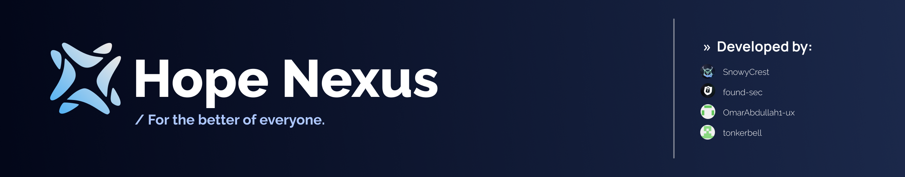
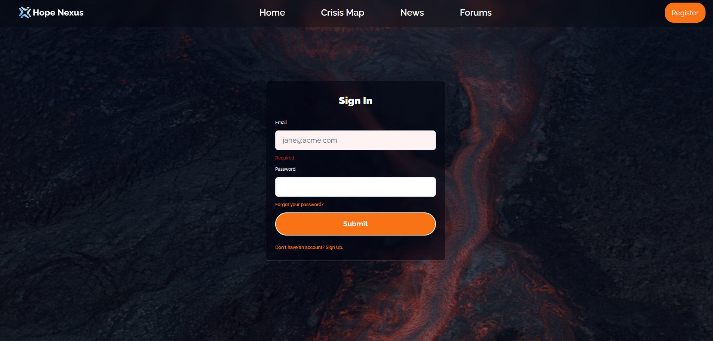
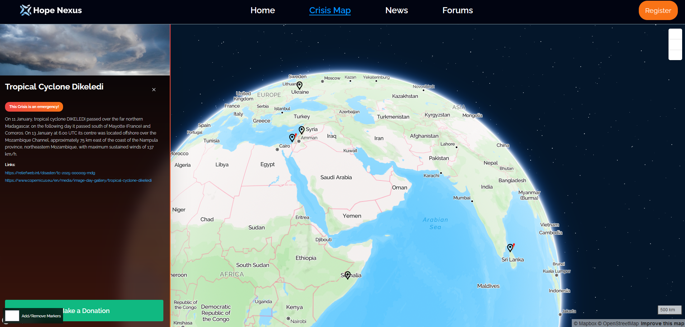

# Hope Nexus 🌍

Hope Nexus is a centralized humanity platform built on Next.js and Supabase. It aims to coordinate, simplify, and centralize donations and campaigns among both individuals and non-profits.

## The Leading Problem 🚨

In the aftermath of a disaster, communities face urgent and diverse needs, varying from food, clean water, and shelter to healthcare and sanitation supplies. However, there is often a gap between the immediate needs of affected populations and the timing of donations received, giving rise to challenges like uncoordinated donations, excessive supply of certain goods, under-supply of others as well as logistical challenges that cause further delays in delivering aid.

A recent study has shown the lack of motivation for individuals to make a difference elsewhere, along with the deficiency of communication and coordination between non-profit organizations has created a sense of distrust for people to make donations, which makes it a real problem that must be addressed. "Only a life lived for others is a life worthwhile." says Albert Einstein, and his quote resonates with what we aim to encourage using our platform.

## The Digital Solution 💡

Our software, Hope Nexus, is a web app that helps coordinate, simplify, and centralize donations and campaigns among both individuals and non-profits.

It will give users who are new to donating an easy and streamlined experience at choosing which area to donate to, and to which nonprofit organization via an interactive, easy-to-use map with a secure payment system.

It will also allow collaboration among Non-profits around the world to communicate & create update logs for individuals to view & stay up to date with the progress of a certain funding campaign while having the authority to create new campaigns according to needs around the world.

These features in a single platform have not been replicated once before. Handling donations and choosing the right organization users want to fund has never been easier, for our objective is to create a hub for humanity where everybody can work together as a nexus of hope to help solve the world's biggest crises.

## Website Features 🌐

| Login                       | Crisis Map                        |
| --------------------------  | --------------------------------- |
|  |      |

| News                         | Forums                          | 
| ---------------------------- | ------------------------------- | 
|        |       | 

## Tech Stack 🛠️

- **Framework**: Next.js
- **Database**: Supabase    
- **Styling**: Tailwind CSS & shadcn/ui
- **Animations**: Framer Motion
- **Icons**: Tabler Icons & React Icons
- **Crisis Map**: Mapbox GL
- **News API**: Perigon
- **Image Handling**: Next/Image (Images are from Unsplash)

## Installation and Execution 🚀

To get started with Hope Nexus, follow these steps:

1. **Clone the repository**:
    ```bash
    git clone https://github.com/yourusername/Hope-Nexus.git
    cd Hope-Nexus
    ```

2. **Install the dependencies**:
    ```bash
    npm install
    ```

3. **Set up environment variables**:
    Replace all of the "YOUR_TOKEN_HERE" texts with your Perigon, Mapbox GL, and Supabase Keys and URLs.

4. **Run the development server**:
    ```bash
    npm run dev
    ```

    Open [http://localhost:3000](http://localhost:3000) with your browser to see the result.


## Dependencies 📦

- `next`
- `react`
- `react-dom`
- `framer-motion`
- `@tabler/icons-react`
- `tailwindcss`
- `supabase-js`

## Installation and Execution 🚀

To get started with Hope Nexus, follow these steps:

1. **Clone the repository**:
    ```bash
    git clone https://github.com/yourusername/Hope-Nexus.git
    cd Hope-Nexus
    ```

2. **Install the dependencies**:
    ```bash
    npm install
    ```

3. **Set up environment variables**:
    Replace all of the "YOUR_TOKEN_HERE" texts with your Perigon, Mapbox GL, and Supabase Keys and URLs.

4. **Run the development server**:
    ```bash
    npm run dev
    ```

    Open [http://localhost:3000](http://localhost:3000) with your browser to see the result.

5. **Build for production**:
    ```bash
    npm run build
    npm start
    ```

    The application will be available at [http://localhost:3000](http://localhost:3000).


## Authors 👨‍💻
- [SnowyCrest](https://github.com/SnowyCrest)
- [found-sec](https://github.com/found-sec)
- [tonkerbell](https://github.com/tonkerbell)
- [OmarAbdullah1-ux](https://github.com/OmarAbdullah1-ux).
  
